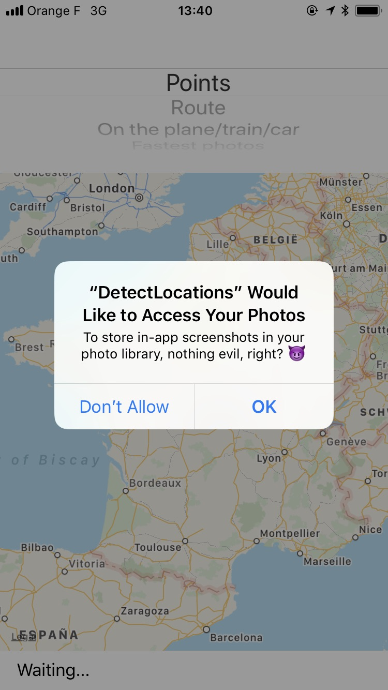
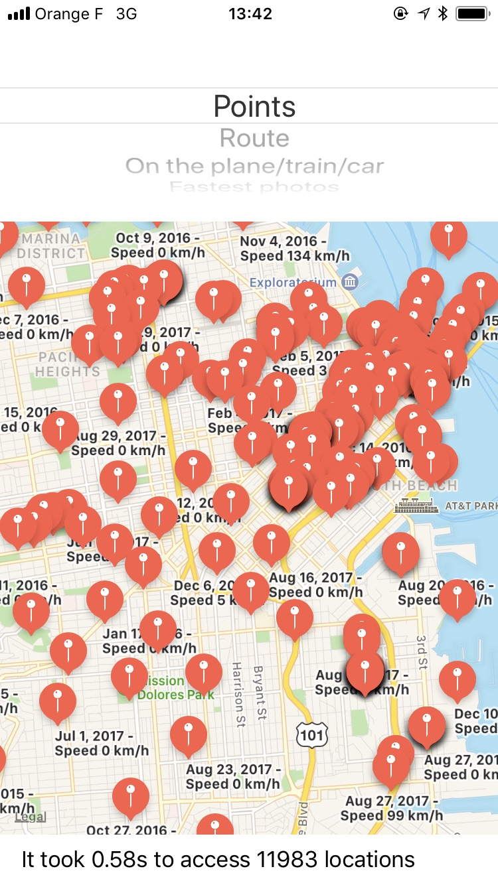
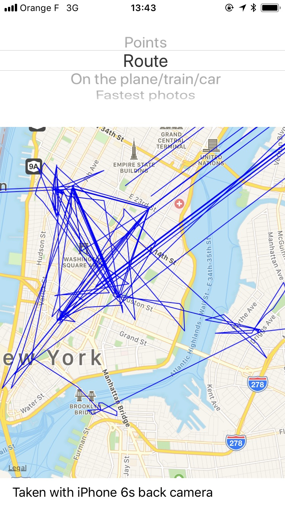
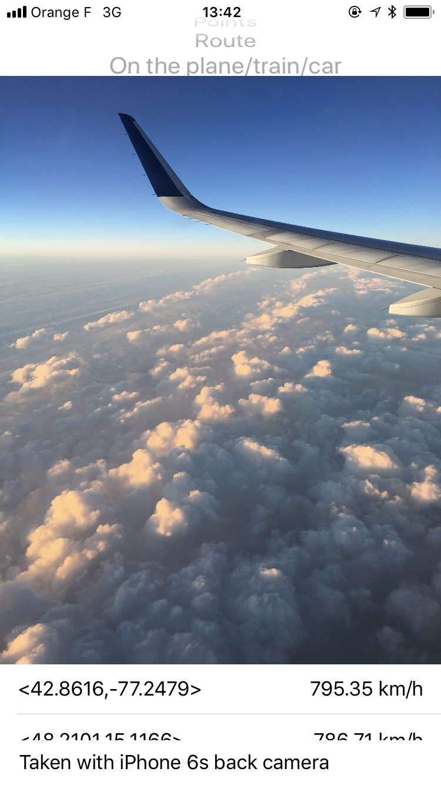
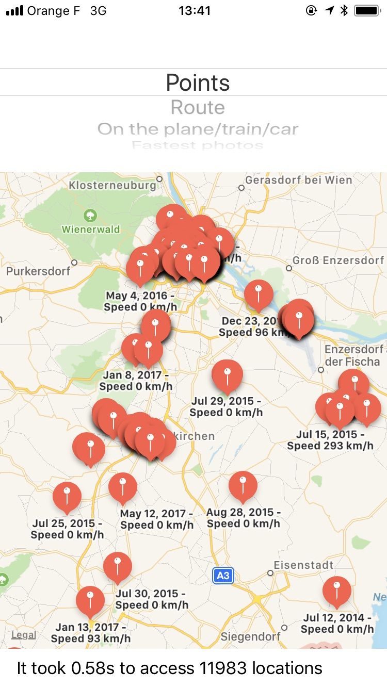
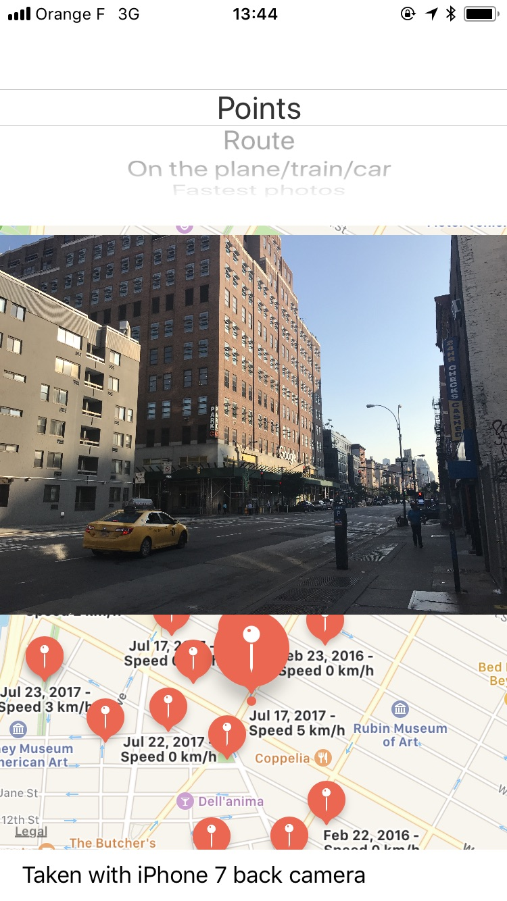

# `detect.location`


Does your iOS app have access to the user's image library? Do you want to know your user's movements over the last several years, including what cities they've visited, which iPhones they've owned and how they travel? Do you want all of that data in less a second? Then this project is for you!


## Disclaimer

`detect.location` is not intended to be used in production. It's a proof of concept to highlight a privacy loophole that can be abused by iOS apps. Apps shouldn't use this. The goal is to close this loophole and give its users better privacy controls for image metadata.

Permission Dialog | Map of locations | Rendering of Route
----|-----|-----
 |  | 

Find the "fastest" photos | Understand the user | Full access to raw photos
----|-----|-----
 |  | 

## What can you do with `detect.location`?

- Get a history of the cities, countries, and other places a user has visited, as long as they took a picture there
- Find the user's place of work, by figuring out where they are from 9 to 5
- Get a complete list of the user's cameras and photography devices (which iPhones, Android phones, cameras) and how long they used each device
- Use facial recognization to find out who the user hangs out with and who their partner is. Is the user single?
- Understand the user's background:
  - Did the user attend college? If so, which one?
  - Did the user recently move from the suburbs to the city?
  - Does the user spend a lot of time with their family?

## What's `detect.location`?

- The native image picker built into iOS allows app developers to access the **full** image library, with all its metadata
- With the raw `PHAsset` object, which represents a picture or video, you also get access to the image's metadata. This includes the location and even the speed at which the user was traveling when the picture was taken. 
- In particular, an app can get the following data:
  - The exact location of each asset
  - The physical speed in which the picture/video was taken (how fast did the camera move)
  - The camera model
  - The exact date + time
  - Other exif image metadata
- With this information, you can render a route of the user's travels, into the past for as long as they've had a GPS-enabled camera (like an iPhone, other smartphone, or modern point-and-shoot)
- You can access all of this metadata without analyzing the _contents_ of the image at all

## Proposal

There should be separate permissions for 

- `Saving a photo` (e.g. a 3rd party camera app wants to save a photo you just took)
- `Selecting a photo` (e.g. you want to upload an existing picture to a social network)
- `Granting full access to the photo library` (e.g. Dropbox or Google Photos to backup your complete library)

Additionally, use of the native image picker should be enforced by Apple, and apps that use a custom one will be rejected.

I've reported this as a radar, which you can dupe: [rdar://34610699](https://openradar.appspot.com/34610699) 👍

## Complexity

The code that exposes all of the above information is fairly easy to write. I built the initial prototype within under an hour, and then spent a little more time on some visualizations to show what the data looks like.

You can look at [DetectLocations/LocationPoint.m](https://github.com/KrauseFx/detect.location/blob/master/DetectLocations/LocationPoint.m) for the complete implementation of accessing all photos, but the basic implementaiton is simple. To access all locations:

```objective-c
PHFetchResult *photos = [PHAsset fetchAssetsWithMediaType:PHAssetMediaTypeImage options:nil];
    
for (PHAsset *asset in photos) {
    if ([asset location]) {
        // Access the full location, speed, full picture, camera model, etc. here
    }
}
```

## About the demo

If an image doesn't load when you tap on a marker / table cell, this means it's a video. A video player wasn't implemented as part of the demo.
